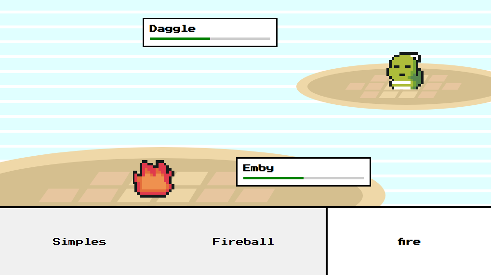

# Jogo Pokémon em JavaScript 🎮

Este é um jogo Pokémon desenvolvido com **JavaScript** e **HTML Canvas**, trazendo uma experiência interativa com manipulação de imagens, animações e lógica de jogo.

## 🖼️ Imagens do Jogo

### 🌆 Vila

### ⚔️ Batalha

## 🔥 Funcionalidades
- 🎵 **Sistema de som** para batalhas e ambientação  
- 🎮 **Movimentação livre** pelo mapa com colisões  
- ⚔️ **Sistema de batalha** inspirado nos jogos clássicos  
- 🛡️ **Ataques do inimigo** com lógica dinâmica  

## 🚀 Jogue Agora!
👉 [Acesse a demo](https://pokemonyt-mathues-otenio.netlify.app/)  

## 📌 Tecnologias Utilizadas
- **JavaScript**
- **HTML5 Canvas**
- **CSS3**

## 📺 Referência
Desenvolvido com base no curso de Chris Courses
